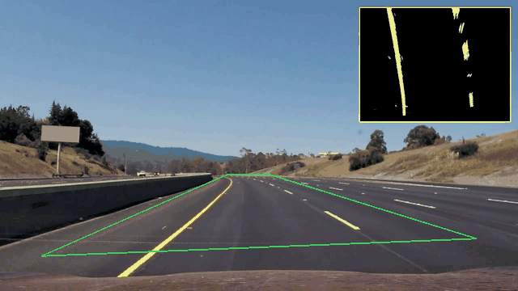
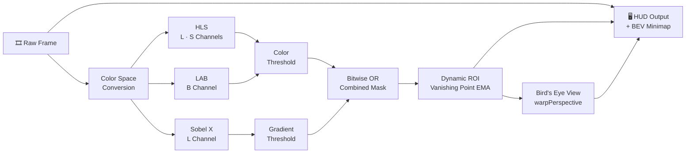

# 🛣️ Real-Time Lane Detection Pipeline

<div align="center">

[](https://www.python.org/)
[](https://opencv.org/)
[](https://numpy.org/)
[](LICENSE)

**Pipeline di Computer Vision per il rilevamento in tempo reale delle corsie stradali.**  
ROI adattiva con stima del punto di fuga · Bird's Eye View · HUD con minimappa integrata

</div>

---

## 🎬 Demo

<div align="center">



*ROI dinamica (verde) che segue il punto di fuga · minimappa Bird's Eye View in alto a destra*

</div>

---

## ✨ Caratteristiche

| Feature | Descrizione |
|:---|:---|
| 🎨 **Multi-Color Space** | Fusione di canali **L** e **S** (HLS) + **B** (LAB) per rilevare sia linee bianche che gialle in ogni condizione di luce |
| 🔎 **Sobel X Gradient** | Filtraggio dei bordi verticali per isolare le linee di corsia ed eliminare il rumore dell'asfalto |
| 📐 **Dynamic ROI** | Stima del punto di fuga tramite `HoughLinesP` con smoothing temporale (EMA) — la maschera si adatta curva dopo curva |
| 🦅 **Bird's Eye View (IPM)** | Trasformazione prospettica top-down (`cv2.warpPerspective`) per linearizzare le corsie parallele |
| 🖥️ **HUD Minimap** | Minimappa BEV con bordo cyan sovrapposta al frame originale — zero finestre aggiuntive |
| 💾 **Headless Support** | Se non c'è un display (WSL / server), salva automaticamente `media/output.mp4` |

---

## 🧠 Pipeline di Elaborazione



---

## 🦅 Bird's Eye View (Inverse Perspective Mapping)

La **Bird's Eye View** trasforma la prospettiva frontale della telecamera (dove le linee parallele sembrano convergere verso l'orizzonte) in una vista zenitale ortogonale — fondamentale per qualsiasi sistema ADAS moderno.

### Perché è essenziale?

- **Parallelismo ripristinato** — nel mondo reale le corsie sono parallele; l'IPM recupera questo invariante nel piano 2D
- **Curvatura misurabile** — consente il calcolo del raggio di curvatura $R$ senza le distorsioni della prospettiva
- **Base per il Polynomial Fitting** — crea il presupposto ideale per lo *Sliding Window Search* e il fit quadratico $f(y) = Ay^2 + By + C$

### Implementazione

I 4 punti trapezoidali `src` vengono mappati sul rettangolo `dst` tramite omografia piana:

```python
src = np.float32([
    [w * 0.165, h * 0.96],   # Bottom-left
    [w * 0.455, h * 0.635],  # Top-left
    [w * 0.545, h * 0.635],  # Top-right
    [w * 0.865, h * 0.96],   # Bottom-right
])

offset = w * 0.25
dst = np.float32([
    [offset,     h],   # Bottom-left
    [offset,     0],   # Top-left
    [w - offset, 0],   # Top-right
    [w - offset, h],   # Bottom-right
])

M    = cv2.getPerspectiveTransform(src, dst)   # Camera → Top-Down
Minv = cv2.getPerspectiveTransform(dst, src)   # Top-Down → Camera
warped = cv2.warpPerspective(binary_mask, M, (w, h), flags=cv2.INTER_LINEAR)
```

---

## 🔀 ROI Dinamica con Stima del Punto di Fuga

A differenza di una ROI trapezoidale fissa, il pipeline stima automaticamente il **punto di fuga** ad ogni frame tramite `HoughLinesP` sulla maschera binaria, separando le rette della corsia sinistra e destra per calcolarne l'intersezione.

Il punto di fuga viene poi **stabilizzato temporalmente** tramite una media mobile esponenziale (EMA, $\alpha = 0.85$) che elimina lo sfarfallio senza introdurre lag:

$$VP_t = \alpha \cdot VP_{t-1} + (1 - \alpha) \cdot VP_{t}^{\text{raw}}$$

Se la stima è fuori dai limiti geometrici validi, il sistema fa fallback sull'ultimo punto di fuga noto.

---

## 🚀 Installazione e Avvio Rapido

### 1. Clona il repository
```bash
git clone https://github.com/Akai165/lane-detector.git
cd lane-detector
```

### 2. Crea e attiva l'ambiente virtuale

```bash
# macOS / Linux
python3 -m venv venv && source venv/bin/activate

# Windows
python -m venv venv && .\venv\Scripts\activate
```

### 3. Installa le dipendenze

```bash
pip install -r requirements.txt
```

### 4. Avvia il rilevatore

Assicurati che il video di test sia presente in `media/project_video.mp4`, poi:

```bash
python main.py
```

> [!TIP]
> Premi **`q`** per interrompere la finestra video. In ambienti **headless** (WSL, server senza display X/Wayland), il programma salva automaticamente l'output elaborato in `media/output.mp4`.

---

## ⚙️ Parametri di Taratura

Tutti i parametri sono concentrati in [`main.py`](main.py) e possono essere modificati senza toccare la logica del pipeline:

| Parametro | Default | Funzione |
|:---|:---:|:---|
| `s_thresh` | `(170, 255)` | Saturazione HLS — isola linee colorate/gialle |
| `sx_thresh` | `(20, 100)` | Soglia gradiente Sobel X — bordi verticali |
| `l_thresh` | `(200, 255)` | Luminosità HLS — linee bianche riflettenti |
| `b_channel` | `(155, 200)` | Canale B di LAB — componente gialla |
| `alpha` | `0.85` | Fattore EMA per lo smoothing del punto di fuga |
| `src` | Trapezio calibrato | 4 punti del piano stradale da proiettare |
| `dst` | Rettangolo + offset | Destinazione ortogonale per la vista dall'alto |
| `offset` | `w * 0.25` | Margine laterale nella Bird's Eye View |
| `MINIMAP_WIDTH/HEIGHT` | `370 × 280 px` | Dimensione minimappa BEV sovrapposta |

---

## 📁 Struttura del Progetto

```
lane-detector/
├── media/
│   ├── demo.png            # Screenshot illustrativo
│   ├── project_video.mp4   # Video di input
│   └── output.mp4          # Video di output (headless)
├── main.py                 # Pipeline completa + loop video
├── requirements.txt        # Dipendenze Python
├── .gitignore
└── README.md
```

---

## 🗺️ Roadmap

- [x] Multi-color space thresholding (HLS + LAB)
- [x] Sobel X gradient filtering
- [x] Bird's Eye View (Inverse Perspective Mapping)
- [x] Dynamic ROI con stima del punto di fuga (HoughLinesP + EMA)
- [x] HUD con minimappa BEV sovrapposta
- [x] Headless output su `output.mp4`
- [ ] **Sliding Window Search** — ricerca a finestre scorrevoli
- [ ] **Polynomial Lane Fitting** — fit quadratico $f(y) = Ay^2 + By + C$
- [ ] **Curvature & Offset** — raggio di curvatura e deviazione dal centro corsia
- [ ] **Temporal Smoothing** — media mobile inter-frame per il polinomio
- [ ] **CLI / Argparse** — `--input`, `--output`, `--headless`

---

## 🛠️ Tecnologie

<div align="center">

| | Libreria | Ruolo |
|:---:|:---|:---|
| 🐍 | **Python 3.9+** | Linguaggio principale |
| 📷 | **OpenCV 4.8+** | Computer Vision, trasformazioni colore, rendering video |
| 🔢 | **NumPy 1.24+** | Operazioni matriciali e bitwise ad alta performance |

</div>

---

## 📄 Licenza

Distribuito sotto licenza **MIT** — consulta il file [`LICENSE`](LICENSE) per i dettagli.
