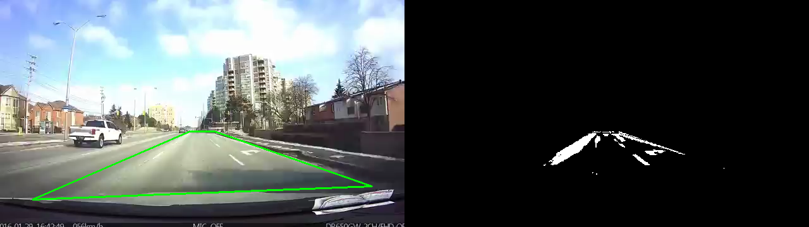
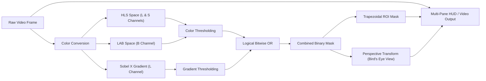

# 🛣️ Real-Time Lane Detection Pipeline

[](https://www.python.org/)
[](https://opencv.org/)
[](https://numpy.org/)
[](LICENSE)
[](CONTRIBUTING.md)

Un pipeline di Computer Vision in tempo reale per il rilevamento delle corsie stradali e la segmentazione della carreggiata (Region of Interest - ROI), sviluppato in Python utilizzando **OpenCV** e **NumPy**.

---

## 📸 Demo Preview


*A sinistra: frame originale con la Region of Interest (ROI) poligonale evidenziata in verde. Al centro: maschera binaria filtrata con ROI. A destra: vista Bird's Eye View (IPM) dall'alto.*

---

## ⚡ Caratteristiche Principali

- **Spazi di Colore Multipli (HLS & LAB)**:
  - Estrazione dei canali **L** (Lightness) ed **S** (Saturation) da **HLS** per isolare linee bianche e contrastare variazioni di luce.
  - Canale **B** da **LAB** per garantire un rilevamento affidabile delle linee gialle anche in presenza di asfalto chiaro o ombre.
- **Rilevamento Bordi Direzionale (Sobel X)**:
  - Calcolo del gradiente orizzontale (filtro di Sobel sull'asse X) per evidenziare i bordi verticali delle linee ed escludere disturbi orizzontali dell'asfalto.
- **Maschera ROI Adattiva (Region of Interest)**:
  - Maschera trapezoidale proporzionale alle dimensioni del frame che isola la corsia di marcia ed elimina cielo, orizzonte, guardrail e cofano del veicolo.
- **Bird's Eye View (Inverse Perspective Mapping - IPM)**:
  - Trasformazione prospettica della carreggiata vista dall'alto (top-down), linearizzando le corsie parallele ed eliminando l'effetto prospettico per preparare l'analisi di curvatura.
- **Visualizzazione HUD Multi-Pane & Headless Support**:
  - Resizing e affiancamento a schermo (`np.hstack`) a 3 riquadri (Originale con ROI, Maschera filtrata, Bird's Eye View) a 1440x270 per un debug visivo immediato o salvataggio automatico su file video (`output.mp4`) in ambienti senza display (WSL/server).

---

## 🧠 Pipeline di Elaborazione



---

## 🦅 Bird's Eye View (Inverse Perspective Mapping - IPM)

La **Bird's Eye View** (vista a volo d'uccello) è un passaggio fondamentale nei moderni sistemi ADAS e di guida autonoma: trasforma la prospettiva frontale della telecamera (in cui le linee parallele sembrano convergere verso il punto di fuga all'orizzonte) in una vista zenitale ortogonale dall'alto.

### 🎯 Perché è fondamentale?
- **Parallelismo delle linee**: Nel mondo reale le linee della corsia sono parallele; la trasformazione prospettica ripristina questo parallelismo nel piano dell'immagine 2D.
- **Misurazione della curvatura**: Permette di calcolare matematicamente il raggio di curvatura ($R$) senza le distorsioni geometriche introdotte dall'inclinazione e dall'altezza della telecamera.
- **Predisposizione per il Polynomial Fitting**: Crea la base ideale per l'algoritmo di **Sliding Window Search** e l'interpolazione quadratica di secondo grado ($f(y) = Ay^2 + By + C$).

### 📐 Calcolo Matematico & Implementazione
La trasformazione viene calcolata tramite omografia piana con le funzioni OpenCV `cv2.getPerspectiveTransform` e `cv2.warpPerspective`:

1. **Selezione dei Punti Sorgente (`src`)**: 4 coordinate di un trapezio calibrato esattamente sulla traiettoria rettilinea della carreggiata:
   - Basso SX: `[w * 0.165, h * 0.96]`
   - Alto SX: `[w * 0.455, h * 0.635]`
   - Alto DX: `[w * 0.545, h * 0.635]`
   - Basso DX: `[w * 0.865, h * 0.96]`
2. **Definizione dei Punti Destinazione (`dst`)**: Un rettangolo proiettato dall'alto con margine laterale (`offset = w * 0.25`) per mantenere la corsia centrata:
   - Basso SX: `[offset, h]`
   - Alto SX: `[offset, 0]`
   - Alto DX: `[w - offset, 0]`
   - Basso DX: `[w - offset, h]`
3. **Calcolo delle Matrici $M$ e $M^{-1}$**:
   ```python
   M = cv2.getPerspectiveTransform(src, dst)      # Proiezione telecamera -> vista dall'alto
   Minv = cv2.getPerspectiveTransform(dst, src)   # Riproiezione vista dall'alto -> telecamera
   ```
4. **Warping della Maschera Binaria**:
   ```python
   warped = cv2.warpPerspective(binary_img, M, (w, h), flags=cv2.INTER_LINEAR)
   ```

---

## 🚀 Installazione e Avvio Rapido

### 1. Clona il repository
```bash
git clone https://github.com/Akai165/lane-detector.git
cd lane-detector
```

### 2. Crea e attiva un ambiente virtuale (consigliato)
```bash
# macOS / Linux
python3 -m venv venv
source venv/bin/activate

# Windows
python -m venv venv
.\venv\Scripts\activate
```

### 3. Installa le dipendenze
```bash
pip install -r requirements.txt
```

### 4. Avvia il rilevatore
Assicurati che il video di test sia presente in `media/project_video.mp4`:
```bash
python main.py
```
> 💡 **Tip**: Premi il tasto **`q`** sulla finestra video per interrompere l'esecuzione in qualsiasi momento. Se eseguito in ambienti headless (es. WSL o server senza server X), il programma salverà automaticamente il video elaborato in `media/output.mp4`.

---

## ⚙️ Taratura dei Parametri (`main.py`)

I parametri della pipeline possono essere regolati all'interno di [main.py](main.py) per adattarsi a diverse condizioni meteo e stradali:

| Parametro | Valore Default | Scopo |
| :--- | :--- | :--- |
| `s_thresh` | `(170, 255)` | Isola linee ad alta saturazione (linee colorate/gialle) |
| `sx_thresh` | `(20, 100)` | Soglia gradiente Sobel X per i bordi verticali |
| `l_thresh` | `(200, 255)` | Cattura linee ad alta luminosità (linee bianche riflettenti) |
| `b_channel` | `(155, 200)` | Seleziona la componente cromatica gialla nello spazio LAB |
| `vertices` | ROI Trapezoidale | Definisce i 4 punti della maschera in percentuale rispetto a `(w, h)` |
| `src` | 4 punti trapezio rettilineo | Coordinate del piano strada da proiettare in vista zenitale |
| `dst` | 4 punti rettangolo con offset | Coordinate di destinazione per la proiezione ortogonale top-down |
| `offset` | `w * 0.25` | Margine laterale per centrare la corsia nella Bird's Eye View |

---

## 📁 Struttura del Progetto

```text
lane-detector/
├── media/
│   ├── demo.png          # Screenshot illustrativo per il README
│   ├── project_video.mp4 # Video di input per il test della pipeline
│   └── output.mp4        # Video di output generato in modalità headless
├── .gitignore            # File e cartelle esclusi dal controllo versione
├── main.py               # Script principale con la pipeline e il loop video
├── README.md             # Documentazione del progetto
└── requirements.txt      # Dipendenze Python necessarie
```

---

## 🗺️ Roadmap & Sviluppi Futuri

- [x] **Bird's Eye View (Perspective Transform)**: Trasformazione prospettica dall'alto verso il basso (Inverse Perspective Mapping - IPM).
- [ ] **Sliding Window Search**: Ricerca a finestre scorrevoli e fitting polinomiale di 2° grado ($f(y) = Ay^2 + By + C$).
- [ ] **Raggio di Curvatura & Offset**: Calcolo matematico del raggio di curvatura della strada e della deviazione dal centro corsia.
- [ ] **Smoothing Temporale**: Filtro a media mobile tra frame consecutivi per ridurre lo sfarfallio.
- [ ] **Supporto CLI / Argparse**: Possibilità di passare percorsi video da riga di comando (`--input`, `--save`).

---

## 🛠️ Tecnologie Utilizzate

- **Python 3**
- **OpenCV (`cv2`)** - Computer Vision, trasformazioni di colore e rendering video
- **NumPy** - Manipolazione matriciale e operazioni bitwise veloci

---

## 📄 Licenza

Distribuito sotto licenza **MIT**. Consulta il file `LICENSE` per maggiori informazioni.
