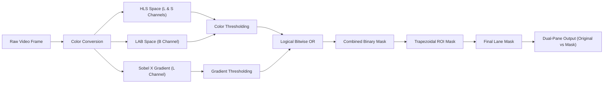

# 🛣️ Real-Time Lane Detection Pipeline

[](https://www.python.org/)
[](https://opencv.org/)
[](https://numpy.org/)
[](LICENSE)
[](CONTRIBUTING.md)

Un pipeline di Computer Vision in tempo reale per il rilevamento delle corsie stradali e la segmentazione della carreggiata (Region of Interest - ROI), sviluppato in Python utilizzando **OpenCV** e **NumPy**.

---

## 📸 Demo Preview


*A sinistra: frame originale con la Region of Interest (ROI) poligonale evidenziata in verde. A destra: maschera binaria filtrata delle linee della carreggiata.*

---

## ⚡ Caratteristiche Principali

- **Spazi di Colore Multipli (HLS & LAB)**:
  - Estrazione dei canali **L** (Lightness) ed **S** (Saturation) da **HLS** per isolare linee bianche e contrastare variazioni di luce.
  - Canale **B** da **LAB** per garantire un rilevamento affidabile delle linee gialle anche in presenza di asfalto chiaro o ombre.
- **Rilevamento Bordi Direzionale (Sobel X)**:
  - Calcolo del gradiente orizzontale (filtro di Sobel sull'asse X) per evidenziare i bordi verticali delle linee ed escludere disturbi orizzontali dell'asfalto.
- **Maschera ROI Adattiva (Region of Interest)**:
  - Maschera trapezoidale proporzionale alle dimensioni del frame che isola la corsia di marcia ed elimina cielo, orizzonte, guardrail e cofano del veicolo.
- **Visualizzazione HUD Split-Screen**:
  - Resizing e affiancamento a schermo (`np.hstack`) a 640x360 per un debug fluido e in tempo reale a basso consumo computazionale.

---

## 🧠 Pipeline di Elaborazione



---

## 🚀 Installazione e Avvio Rapido

### 1. Clona il repository
```bash
git clone https://github.com/tuo-username/lane-detector.git
cd lane-detector
```

### 2. Crea e attiva un ambiente virtuale (consigliato)
```bash
# macOS / Linux
python3 -m venv venv
source venv/bin/activate

# Windows
python -m venv venv
.\venv\Scripts\activate
```

### 3. Installa le dipendenze
```bash
pip install -r requirements.txt
```

### 4. Avvia il rilevatore
Assicurati che il video di test sia presente in `media/test.mp4`:
```bash
python main.py
```
> 💡 **Tip**: Premi il tasto **`q`** sulla finestra video per interrompere l'esecuzione in qualsiasi momento.

---

## ⚙️ Taratura dei Parametri (`main.py`)

I parametri della pipeline possono essere regolati all'interno di [main.py](file:///Users/flavio/Documents/lane-detector/main.py) per adattarsi a diverse condizioni meteo e stradali:

| Parametro | Valore Default | Scopo |
| :--- | :--- | :--- |
| `s_thresh` | `(170, 255)` | Isola linee ad alta saturazione (linee colorate/gialle) |
| `sx_thresh` | `(20, 100)` | Soglia gradiente Sobel X per i bordi verticali |
| `l_thresh` | `(200, 255)` | Cattura linee ad alta luminosità (linee bianche riflettenti) |
| `b_channel` | `(155, 200)` | Seleziona la componente cromatica gialla nello spazio LAB |
| `vertices` | ROI Trapezoidale | Definisce i 4 punti della maschera in percentuale rispetto a `(w, h)` |

---

## 📁 Struttura del Progetto

```text
lane-detector/
├── media/
│   ├── demo.png         # Screenshot illustrativo per il README
│   └── test.mp4         # Video di input per il test della pipeline
├── .gitignore           # File e cartelle esclusi dal controllo versione
├── main.py              # Script principale con la pipeline e il loop video
├── README.md            # Documentazione del progetto
└── requirements.txt     # Dipendenze Python necessarie
```

---

## 🗺️ Roadmap & Sviluppi Futuri

- [ ] **Bird's Eye View (Perspective Transform)**: Trasformazione prospettica dall'alto verso il basso (IPM).
- [ ] **Sliding Window Search**: Ricerca a finestre scorrevoli e fitting polinomiale di 2° grado ($f(y) = Ay^2 + By + C$).
- [ ] **Raggio di Curvatura & Offset**: Calcolo matematico del raggio di curvatura della strada e della deviazione dal centro corsia.
- [ ] **Smoothing Temporale**: Filtro a media mobile tra frame consecutivi per ridurre lo sfarfallio.
- [ ] **Supporto CLI / Argparse**: Possibilità di passare percorsi video da riga di comando (`--input`, `--save`).

---

## 🛠️ Tecnologie Utilizzate

- **Python 3**
- **OpenCV (`cv2`)** - Computer Vision, trasformazioni di colore e rendering video
- **NumPy** - Manipolazione matriciale e operazioni bitwise veloci

---

## 📄 Licenza

Distribuito sotto licenza **MIT**. Consulta il file `LICENSE` per maggiori informazioni.
